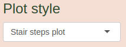

# Introduction

Welcome to the HMigD I App tutorial! This guide will walk you through the various panels and sub-panels of the app, providing detailed explanations and instructions.

# Data and assumptions
## Input flows 

### Migration flows 
<!--  -->

The "Migration flows" sub-panels allow you to explore immigration and emigration data sources, as well as the immigration and emigration data itself. Use the "Year" slider to change the year slice of the displayed data sources and data. 

You can download information about the sources and raw data as xlsx files using  at the bottom of each sub-panel page.

#### Data sources {#DataSrc}

Sub-panels "Immigration data sources" and "Emigration data sources" can be used to explore the data sources used in the project. The project relies on various sources, as depicted in the legend of the plot:

 

Specificaly, QuantMig estimates were employed to ascertain bilateral flows between Greece (GR), Hungary (HR), Malta (MT), and Portugal (PT). The absence of specific bilateral data from these countries necessitated the use of QuantMig estimates to fill in entirely empty corridors.

For more detailed information about migration data sources, including links, refer to the bottom of both sub-panels. Additionally, each panel features a  button that allows you to view a summary (distribution) of data sources in the form of a pie chart.

#### Raw data

The raw data can be inspected (visualized) and downloaded using the "Immigration data" and "Emigration data" sub-panels. Please note that the flows are classified according to a quasi-logarithmic scale, as shown in the legend:

 

### Accuracy {#accuracy}

The "Accuracy" sub-panel provides insights into the accuracy of administrative immigration and emigration data. Accuracy issues are related to random errors rather than systematic errors made in the data collection process. The accuracy was classified using available metadata, taking into account the type of administrative data source (register, hybrid, survey, other, European Commission 2003; Mooyaart et al. 2021), and information on the quality of the register and hybrid sources. We also decrease accuracy for data available on the UN or used by IMEM but absent or removed from Eurostat, as well as for flows characterized by high undercounting (adjusted classification, see below).

We consider three levels of accuracy: low, medium, and high, with some remarks shown on the legend of the plot:

 

"Low (QuantMig)" indicates that QuantMig estimates were utilized for bilateral flows between Greece (GR), Hungary (HR), Malta (MT), and Portugal (PT). These countries do not provide any bilateral data, necessitating the use of QuantMig estimates to fill completely empty corridors between them (see also \@ref(DataSrc)). "High (*)" for Germany (DE) implies that while Germany is generally classified as having high accuracy for most reported bilateral flows, for flows to/from Denmark (DK), we assume low accuracy due to the high probability of using mirror statistics by DE or DK for these flows.

The user has the option to see adjusted or unadjusted (baseline) accuracy classification. Clicking on  on the right side shows detailed information about the adjustment.

At the bottom of the page, there are buttons that allow users to download the plot and underlying data:

### Undercounting {#undercounting}

Undercounting reflects a non-systematic bias in migration estimates. The classification to a specific level of undercounting is based on the bilateral flow ratio model (Dańko, 2021; Dańko et al., 2023), which evaluates undercounting according to the ratio of the flow from a country to a group of countries assumed to provide high-quality data (i.e., the Nordic countries, Belgium, the Netherlands, and Switzerland) reported by that country to the flow in the same direction but reported by the group of high-quality data countries. The bilateral flows ratio model takes into account variations in the definition of the duration of stay among countries (Del Fava et al. 2024).

Specifically, we assume low undercounting for the QuantMig estimates used for a few corridors. Refer to \@ref(DataSrc) and \@ref(accuracy) for more details about why QuantMig estimates were used.

Similar to the "Accuracy" sub-panel (section \@ref(accuracy)), the "Undercounting" sub-panel allows you to inspect a five-level undercounting classification for immigration and emigration data separately. You can also download the plot and underlying data using buttons at the bottom of the page.

### Coverage {#coverage}

Coverage is a systematic bias due to the rules that govern the data collection process, which may exclude certain population segments, e.g., national return migrants or foreigners not being counted in the official immigration and emigration counts, respectively. Moreover, subpopulations such as asylum seekers, nomad populations, military personnel, homeless people, as well as some geographic areas may not be included in the migration data (Del Fava et al. 2024).

The "Coverage" sub-panel displays a table with country classifications ("Low" or "High"). You can download this table as an xlsx file using the  button.

### Duration of stay {#duration-of-stay}

The definition of a migrant centers on the duration of stay. In 2008, a significant shift occurred with the introduction of the 12-month minimum duration-of-stay criterion as a standard (Reg (EC) 862/2007 by The European Parliament and the European Council). Challenges in understanding migration may arise when the minimum duration of stay deviates from international standards. Consequently, it is essential to include the duration of stay in migration models to address these challenges.

The "Duration of Stay" sub-panel provides a plot showing the classification of duration of stay for different countries for immigration and emigration data separately. You can Download the plot and underlying data using buttons at the bottom of the plot similarly as in Accuracy sub-panel.

## Input transitions (LFS)

### Migration transitions

The "Migration Transitions" sub-panel allows you to explore classified transition counts. Click  button to display the summary.
<!-- You can download the underlying transition data as an xlsx file by clicking  button. -->

### Accuracy

The "Accuracy" sub-panel provides a table estimating the **non-adjusted** and **undercounting-adjusted** accuracy of LFS data. The undercounting-adjusted accuracy takes into account undercounting, ensuring that accuracy is set to low when undercounting is high. You can download the table using the top-left  button.

The method of calculating **non-adjusted** accuracy is shown below the table in the plot. **Non-adjusted** accuracy for LFS data is estimated as the year-averaged coefficient of variation (CV) calculated among the number of immigrants at the destination in a particular year. Countries are categorized into high and low classes using the median value as the threshold. Red rectangles indicate missing data, cases with no migration data reported, or situations where the CV could not be calculated.

### Undercounting

The undercounting of LFS data is based on two components. The table shows all component measures and the **Combined measure** along with its classification. The classification uses the first quartile of the combined measure as a threshold. You can download the table using the top-left  button.

The **Combined measure** of undercounting in LFS data, shown in the **first** plot, is calculated as (1 - (1 - **Fraction of non-responding**) $\times$ (1 - **Fraction of missing**)), where:

- **Fraction of missing** is shown in the **second** plot and indicates the fraction of the population group with missing migration data in the total estimated population.

- **Fraction of non-responding** shown in the **third** plot indicates the non-response fraction of the studied population. Clicking on  in the **third** plot caption displays detailed information about the method of calculation of this measure.

### Coverage

The classification of coverage is based on the type of households included. "Low" coverage includes only private households, while "high" coverage includes both private households and collective accommodations. In the "Coverage" sub-panel, there is a table with a download option available through the  button.

## Covariates

### Freedom of movement of workers

The "Freedom of Movement of Workers" sub-panel features a year slider, plot, and information about sources shown in the bottom panel. Using the right part of that panel, you can also download both data and images in the selected format.

<!--  -->

 

On the plot, values other than zero or one represent cases where restrictions were intermediate or occurred during the year.

<!--  -->

 

### Population size

The "Population size" sub-panel displays classified population size counts. You can download both the data and image in the selected format from the right part of the bottom panel, where you can also find information about the data source.

 

Note that the population size is classified on a quasi-logarithmic scale, as depicted in the plot legend:

 

<!-- While there might be better estimates of population size (provided for example by HMD or FHD projects) we use Eurostat estimates for consistency with migration flows. -->

# Results
## Model estimates & comparison

### Compare single flows

The "Compare single flows" sub-panel allows you to (1) compare data and model fits by choosing from different models and countries; (2) customize the plot using graphical options and export the results; and (3) provide feedback in the survey frame at the bottom.

#### General settings and plot {#singlemodels}

There are six models available in the app, differing in how the freedom of movement of workers is modeled and whether LFS is included:

&nbsp;&nbsp;&nbsp;&nbsp;&nbsp;&nbsp; "(a) Freedom of movement of workers excluded, LFS included" 
&nbsp;&nbsp;&nbsp;&nbsp;&nbsp;&nbsp; "(b) Freedom of movement of workers excluded, LFS excluded" 
&nbsp;&nbsp;&nbsp;&nbsp;&nbsp;&nbsp; "(c) Freedom of movement of workers simple, LFS included" 
&nbsp;&nbsp;&nbsp;&nbsp;&nbsp;&nbsp; "(d) Freedom of movement of workers simple, LFS excluded" 
&nbsp;&nbsp;&nbsp;&nbsp;&nbsp;&nbsp; "(e) Freedom of movement of workers new EU -> old EU+, LFS included" 
&nbsp;&nbsp;&nbsp;&nbsp;&nbsp;&nbsp; "(f) Freedom of movement of workers new EU -> old EU+, LFS excluded" 

Freedom of movement in models c-f is modeled as a single-parameter term. "Freedom of movement of workers simple" implies that freedom of movement is considered for entire bilateral flows, while "Freedom of movement of workers new EU -> old EU+" means that freedom of movement is only considered for flows from A8 countries, RO, BG, and HR to old EU (EU-15), Switzerland (CH), and Norway (NO).

To select models, use the following frame:

  

By default, a recommended model is initially selected, but you can change it by using the drop-down lists and select one of the remaining models. The optional model #2 is available for comparison and can be selected in the same way.

In the next frame below, you can use the drop-down lists to select the sending and receiving countries to be displayed in the bottom plot.

 

You can swap the countries using the  button.

#### Graphical options and saving the plot

In the same frame, you can find three potentially useful graphical options.

 

The "Show legend" option can hide some legends on the plot for better clarity, while the "Show IMEM/QuantMig estimates" displays results from past external projects (IMEM and QuantMig) for comparison. Click on  for details. Finally, the "Fix maximum value on the Y-axis" option enables editing the "Max Y-axis value" field and sets it for all subsequent plots.

 

At the bottom of the page, there is an additional option for the type of plotting: the "Plot style" with a drop-down list, offering "Linear interpolation" plot, "Stair steps" plot (default), and "Spline interpolation" plot.

 

Using other options in this frame, you can also download estimates and save the plot in a specific format.

 

#### Interpreting the plot

The plot features a legend on the right side, unless the  option is unmarked. The accuracy of the data used in the model is represented by three levels of transparency, where the highest transparency indicates the lowest accuracy. LFS data has only two levels: low and high, which correspond to the two highest levels of transparency. The color of data points denotes the data source: red for data provided by the sending country, blue for data provided by the receiving country, and green for LFS data provided by the receiving country.

 

The size and shape of the data points indicate undercounting and duration of stay, respectively. We categorize undercounting and duration of stay into five classes. The smaller the data point, the greater the undercounting. Circles represent a duration of stay ranging from 8 to 12 months (12 months for the vast majority of countries), which is closest to the standard definition.

 

LFS data have only two levels of undercounting: "high" denoted by a smaller data point and "low" denoted by a larger data point. As transitions, they have a 12-month duration of stay by definition.

 

Solid lines represent the predicted model fit, specifically the median of the posterior distribution. If the default and optional models are identical, only one black line is displayed.

 

The gray areas represent credibility intervals. The dark gray area represents the interquartile range of the posterior distribution, and the light gray area is determined by the 5th and 95th percentiles of the posterior distribution.

 

When you use the  option, additional predictions (lines) with credibility intervals appear for the IMEM and QuantMig models, along with a legend in the top-left corner of the plot.

 

#### Survey

We encourage you to leave a comment about a flow you are investigating or just a general comment. To do so, please use the following frame below the plot.

 

Once you fill in all the fields, you can submit your comment by clicking the  button. Another button, , is reserved for our internal purposes. However, if you are interested in viewing or removing your feedback, please write to us at danko@demogr.mpg.de.

### Compare aggregated flows {#aggregated}

The app allows you to compare aggregated flows. At the top of the page, you can select the models you want to compare. 

 
By default, the models are set to "(b) Freedom of movement of workers excluded, LFS excluded" and "(f) Freedom of movement of workers new EU -> old EU+, LFS excluded". See \@ref(singlemodels) for the entire list of models and their descriptions.

In the next frame, you have the option to select a specific set of countries in the context of freedom of movement of workers.

 

The first group of cases is related to granting freedom of movement of workers to A8 countries immediately after accession to the EU by IE, SE, and UK in 2004:

&nbsp;&nbsp;&nbsp;&nbsp;&nbsp;&nbsp; '(1a) Freedom of movement of CZ, EE, HU, LT, LV, PL, SI and SK workers granted by IE in 2004' 
&nbsp;&nbsp;&nbsp;&nbsp;&nbsp;&nbsp; '(1b) Freedom of movement of CZ, EE, HU, LT, LV, PL, SI and SK workers granted by SE in 2004' 
&nbsp;&nbsp;&nbsp;&nbsp;&nbsp;&nbsp; '(1c) Freedom of movement of CZ, EE, HU, LT, LV, PL, SI and SK workers granted by UK in 2004' 
&nbsp;&nbsp;&nbsp;&nbsp;&nbsp;&nbsp; '(1d) Freedom of movement of CZ, EE, HU, LT, LV, PL, SI and SK workers granted by IE, SE, and UK in 2004' 

The second group of cases is related to granting freedom of movement of workers to A8 countries by FI, IS, and NO in 2006, However, it must be noted that in case of NO it was a gradual process (see Covariates / Freedom of movement panel):

&nbsp;&nbsp;&nbsp;&nbsp;&nbsp;&nbsp; '(2a) Freedom of movement of CZ, EE, HU, LT, LV, PL, SI and SK workers granted by FI in 2006' 
&nbsp;&nbsp;&nbsp;&nbsp;&nbsp;&nbsp; '(2b) Freedom of movement of CZ, EE, HU, LT, LV, PL, SI and SK workers granted by IS in 2006' 
&nbsp;&nbsp;&nbsp;&nbsp;&nbsp;&nbsp; '(2c) Freedom of movement of CZ, EE, HU, LT, LV, PL, SI and SK workers granted by NO in 2006' 
&nbsp;&nbsp;&nbsp;&nbsp;&nbsp;&nbsp; '(2d) Freedom of movement of CZ, EE, HU, LT, LV, PL, SI and SK workers granted by FI, IS, and NO in 2006' 

The third group of cases is related to granting freedom of movement of workers to A8 countries by NL in 2007:

&nbsp;&nbsp;&nbsp;&nbsp;&nbsp;&nbsp;  '(3) Freedom of movement of CZ, EE, HU, LT, LV, PL, SI and SK workers granted by NL in 2007' 

The fourth group of cases is related to granting freedom of movement of workers to A8 countries by FR in 2008:

&nbsp;&nbsp;&nbsp;&nbsp;&nbsp;&nbsp;  '(4) Freedom of movement of CZ, EE, HU, LT, LV, PL, SI and SK workers granted by FR in 2008' 

The fifth group of cases is related to granting freedom of movement of workers to A8 countries by BE and DK in 2009:

&nbsp;&nbsp;&nbsp;&nbsp;&nbsp;&nbsp; '(5a) Freedom of movement of CZ, EE, HU, LT, LV, PL, SI and SK workers granted by BE in 2009' 
&nbsp;&nbsp;&nbsp;&nbsp;&nbsp;&nbsp; '(5b) Freedom of movement of CZ, EE, HU, LT, LV, PL, SI and SK workers granted by DK in 2009' 
&nbsp;&nbsp;&nbsp;&nbsp;&nbsp;&nbsp; '(5c) Freedom of movement of CZ, EE, HU, LT, LV, PL, SI and SK workers granted by BE and DK in 2009' 

The sixth group of cases is related to granting freedom of movement of workers to A8 countries by AT, CH, and DK in 2011. Note, however, that the freedom of movement for workers was suspended by CH for a few years (see Covariates / Freedom of movement panel):

&nbsp;&nbsp;&nbsp;&nbsp;&nbsp;&nbsp; '(6a) Freedom of movement of CZ, EE, HU, LT, LV, PL, SI and SK workers granted by AT in 2011' 
&nbsp;&nbsp;&nbsp;&nbsp;&nbsp;&nbsp; '(6b) Freedom of movement of CZ, EE, HU, LT, LV, PL, SI and SK workers granted by CH in 2011(\*)' 
&nbsp;&nbsp;&nbsp;&nbsp;&nbsp;&nbsp; '(6c) Freedom of movement of CZ, EE, HU, LT, LV, PL, SI and SK workers granted by DE in 2011' 
&nbsp;&nbsp;&nbsp;&nbsp;&nbsp;&nbsp; '(6d) Freedom of movement of CZ, EE, HU, LT, LV, PL, SI and SK workers granted by AT, CH(\*), and DE in 2011' 

The seventh group of cases is related to the accession of BG and RO to the EU in 2014:

&nbsp;&nbsp;&nbsp;&nbsp;&nbsp;&nbsp; '(7a) Freedom of movement of BG and RO workers granted by AT in 2014' 
&nbsp;&nbsp;&nbsp;&nbsp;&nbsp;&nbsp; '(7b) Freedom of movement of BG and RO workers granted by BE in 2014' 
&nbsp;&nbsp;&nbsp;&nbsp;&nbsp;&nbsp; '(7c) Freedom of movement of BG and RO workers granted by DE in 2014' 
&nbsp;&nbsp;&nbsp;&nbsp;&nbsp;&nbsp; '(7d) Freedom of movement of BG and RO workers granted by FR in 2014' 
&nbsp;&nbsp;&nbsp;&nbsp;&nbsp;&nbsp; '(7e) Freedom of movement of BG and RO workers granted by NL in 2014' 
&nbsp;&nbsp;&nbsp;&nbsp;&nbsp;&nbsp; '(7f) Freedom of movement of BG and RO workers granted by UK in 2014' 
&nbsp;&nbsp;&nbsp;&nbsp;&nbsp;&nbsp; '(7g) Freedom of movement of BG and RO workers granted by AT, BE, DE, FR, NL, and UK in 2014' 

There are also other cases that partially relate to the cases shown above but include a bigger number of countries:

&nbsp;&nbsp;&nbsp;&nbsp;&nbsp;&nbsp; '(1e) Freedom of movement of CH, CY, CZ, EE, HU, LT, LV, MT, PL, SI and SK workers granted by IE in 2004' 
&nbsp;&nbsp;&nbsp;&nbsp;&nbsp;&nbsp; '(1f) Freedom of movement of CH, CY, CZ, EE, HU, LT, LV, MT, PL, SI and SK workers granted by SE in 2004' 
&nbsp;&nbsp;&nbsp;&nbsp;&nbsp;&nbsp; '(1g) Freedom of movement of CH, CY, CZ, EE, HU, LT, LV, MT, PL, SI and SK workers granted by UK in 2004' 
&nbsp;&nbsp;&nbsp;&nbsp;&nbsp;&nbsp; '(1h) Freedom of movement of CH, CY, CZ, EE, HU, LT, LV, MT, PL, SI and SK workers granted by IE, SE, and UK in 2004' 

&nbsp;&nbsp;&nbsp;&nbsp;&nbsp;&nbsp;  '(5d) Freedom of movement of BG, CZ, EE, HU, LT, LV, PL, RO, SI and SK workers granted by DK in 2009' 

&nbsp;&nbsp;&nbsp;&nbsp;&nbsp;&nbsp;  '(7h) Freedom of movement of BG and RO workers granted by AT, BE, DE, FR, LU, MT, NL, and UK in 2014' 

In the same frame, instead of selecting specific cases, you can manually select sending and receiving countries:

 

To speed up the selection, you can use buttons that select specific groups of countries:

 

Particularly, you can use "Same as..." to clone the selection from the counter source/destination or "Swap" selected countries between sending and receiving panels.

The app also offers several aggregating and graphical options:

 

Displaying aggregated data via the option  is not set as a default option because it may not provide reliable values. Firstly, aggregated data points are calculated by summing incompatible data with different qualities and definitions of a migrant based on the minimum duration of stay (migration flows measured in different units). Secondly, many data points may be missing, and the sum may be simply undercounted, especially if you select the option .

The option frame gives you control over displaying credibility intervals for the predicted flows using , a legend on the right side of the plot via , and a title on the top of the plot using .

You can show or hide the vertical line on the plot denoting the year of granting freedom of movement by the receiving country using  and adjust its value using arrows . When you select a case from the "Exemplary cases" list, the threshold year is automatically set to the value corresponding to the selected case.

When you use the  option, additional predictions (lines) appear for the IMEM and QuantMig models, along with a legend in the top-left corner of the plot. There is no possibility to plot credibility intervals for the aggregated IMEM and QuantMig estimates.

At the bottom of the page, there is an additional option for the type of plotting: the "Plot style" with a drop-down list, offering "Linear interpolation" plot, "Stair steps" plot (default), and "Spline interpolation" plot.

 

Using other options in this frame, you can also download estimates and save the plot in a specific format.

 

### Circular plots

The Circular Plots panel helps visualize single and aggregated flows in the form of circular flow plots for the selected model. The model selection can be done through a dropdown list, similar to the "Compare Single Flows" and "Compare Aggregated Flows" subpanels (see sections \@ref(singlemodels) and \@ref(aggregated) respectively):

 

Similar to aggregated flows (section \@ref(aggregated)), users can select several receiving and sending countries.

 

Fast selection of countries can be performed using the following buttons, as described in section \@ref(aggregated).

 

You have the option to show or hide the scale on the plot:

 

To change the year, use the "Year Slider" on the right side of the plot:

 

If you want to mask some flows, use the "Limit Visible Flows" slider next to the "Year" slider. The masking method uses the percentile method, so the higher the value on the slider, the more flows are masked.

 

The plot can be saved in a chosen format using the bottom frame:

 

## Model mixing & download Panel

### Fast download of estimated flows {#FastDwn}

This panel allows you to view and download entire estimates using the  button. While model estimates shown in the table include only median values, the downloaded results also include credibility intervals.

Use the  and  fields to navigate through the table. 

You can set the maximum displayed number of rows using the  field.

### Alternative model selection

Initially, the table displays the model recommended for specific flows, based on our informed arbitrary decisions.

 

However, the user can change this selection by double-clicking on the specific field and selecting the appropriate model.

 

You can import and export your selection to/from your local storage as well as restore default settings using:

 

You can also fill the entire table with a single value using:

 

At the bottom, you will find a table similar to the one in the previous panel (section \@ref(FastDwn)). Use the  button to download the entire database, which is based on the user selected models from the top table.

### Visualiztion of the database

This panel shows a simple summary of the database using user model selection. The flows are classified according to a quasi-logarithmic scale, as shown in the legend:

 

To navigate across years, use the "Year" slider:

# Remarks

Thank you for completing the tutorial. For any issues and questions, please contact Maciej Danko at <danko@demogr.mpg.de>.
